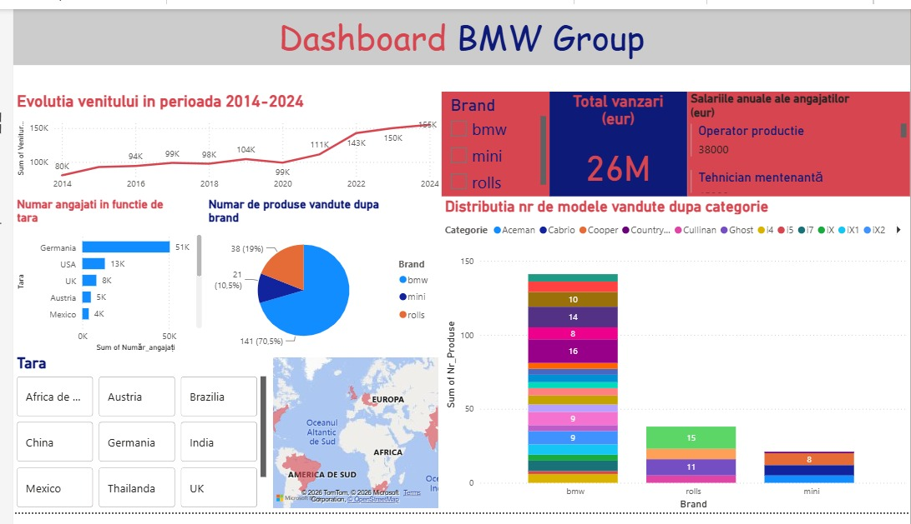

# BMW Group Business Data Analysis

This project was developed as part of my Decision Support Systems coursework. The main objective was to analyze different aspects of BMW Group's activity using database management, data analysis, forecasting and data visualization techniques.

The project combines publicly available BMW Group data with simulated records created for academic purposes.

## Tools Used

- Microsoft Excel
- Microsoft Access
- Power BI

## Project Overview

The analysis was divided into several parts, starting with the organization of the data and continuing with statistical analysis, forecasting and visualization.

### Database Management

The data was initially organized in Excel and then imported into Microsoft Access.

The database contains information about:

- products
- customers
- employees
- jobs
- company locations
- sales
- financial indicators
- stock prices

Relationships between the tables were created in Access, followed by several queries used to analyze sales, transaction values and employee information.

### Data Cleaning and Analysis

Excel was used to check and prepare the data before the analysis.

Some of the tasks included:

- checking text formatting
- validating phone numbers
- checking date values
- formatting numerical and financial data
- identifying possible outliers using the IQR method
- calculating descriptive statistics for financial indicators

The financial analysis included indicators such as revenue, EBITDA, net profit, total assets, equity and total liabilities.

### Power BI Dashboard

An interactive Power BI dashboard was created to summarize the main results of the analysis.

The dashboard includes:

- revenue evolution between 2014 and 2024
- total sales
- employee distribution by country
- product sales by brand
- model distribution by vehicle category
- geographical information about company locations
- filters for brand and country

### Forecasting

The project also includes a time series analysis of BMW Group's stock closing prices.

Several forecasting methods were compared:

- moving average
- exponential smoothing
- TREND function
- linear regression
- Holt-Winters

The predicted values were compared with actual stock prices in order to evaluate the performance of the different methods.

### Decision Analysis

A decision-making problem was analyzed using the TOPSIS method.

Three strategic alternatives were compared based on criteria related to operational capacity, estimated costs and strategic impact. The purpose of this analysis was to identify the most suitable alternative based on several criteria rather than a single indicator.

## What I Learned

This project helped me understand how different data analysis tools can be used together in the same workflow.

I gained practical experience in organizing relational data, preparing and analyzing datasets in Excel, creating queries in Access, building interactive reports in Power BI and applying basic forecasting and decision-making methods.

It also helped me understand how raw data can be transformed into information that can support business decisions.

## Project Context

This is an individual academic project developed as part of my university coursework in Decision Support Systems.
